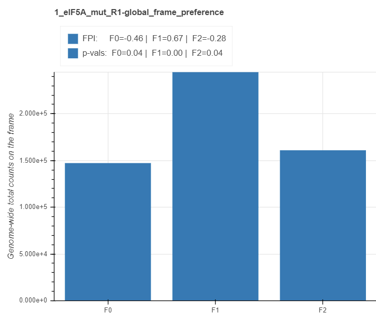
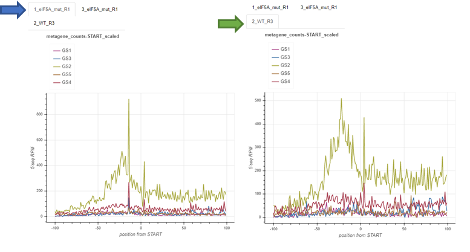

.. _interpreting_output:

***********************
Interpreting the output
***********************

=============================================
Demo data
=============================================

The following examples are produced by fivepseq v1.0b0 taking as input `alignment and genome files <http://data.pelechanolab.com/software/fivepseq/data/test_data_1.0b0/yeat_eIF5A/>`_ from yeast of three strains: wild type (BY4741) and translation elongation factor eIF5A mutants (hyp2-3 and hyp2-1). You may find description of the dataset in the _README.txt file.   

Download and navigate to the yest_eIF5A folder and run the following command to produce fivepseq output: 

.. code-block:: shell

 fivepseq \
    -g genome/* \
    -a gff/* \
    -b "bam/*.bam" \
    -o fivepseq \
    -t yeast_eIF5A \
    -gs genesets/genesets_eIF5A.txt

This will produce a filetree that looks like this: 

.. code-block:: shell

    fivepseq
    ├── fivepseq_counts
    ├── fivepseq_plots
    │   ├── main
    │       ├── png
    │       ├── svg
    │       ├── yeast_eIF5A_combined.html
    │       ├── yeast_eIF5A_main.html
    │   ├── supplement
    │       ├── png
    │       ├── svg
    │       ├── yeast_eIF5A_amino_acid_scatterplots.html
    │       ├── yeast_eIF5A_codon_heatmaps.html
    │       ├── yeast_eIF5A_codon_scatterplots.html
    │   ├── genesets
    │       ├── png
    │       ├── svg
    │       ├── yeast_eIF5A_samples_per_geneset.html
    │       ├── yeast_eIF5A_genesets_per_sample.html
    │   ├── yeast_eIF5A.html   # <<-- this is the main entry point for all the reports
    ├── log
    ├── count_summary.txt

You may directly download the report files `from here <http://data.pelechanolab.com/software/fivepseq/data/test_data_1.0b0/yeast_eIF5A_fivepseq_reports/>`_.  

============================================
Entry point: fivepseq_plots/RUNNAME.html
============================================

This file contains a summary of your run, and links to variuos reports. 

Input and run configurations
_____________________________
This paragraph stores absolute paths to your input files and options provided. 

Summary statistics
_____________________________

For now, the number of reads in the coding regions is provided for each sample, in millions (M). 

Report files
_____________________________

This section contains hyperlinks to various report files. **Note** that your files should be in the same subfolders to be found and opened with your browser. If you've made rearrangements, you should find and open the files directly. 

=============================================================
General notes on interacting with html report files
=============================================================

Be patient when loading, please
________________________________

The report files are heavy due to the large number of points contained in them. Please, **wait for a couple of minutes** until the white screen is replaced with charts. 

Selecting samples
_____________________________
Sometimes plotting many samples may produce messy graphs that are hard to make sense of. You may use the legend box to filter the samples you’d like to focus on. The legend box is located at the top of each graph in the report file. Clicking on each of the samples in the box will make it disappear or appear back. 

.. image:: _static/hide_samples.png

Hovering
_____________________________

To get exact count information for each sample at the point of interest, simply hover with the mouse over the point and pick your desired sample. A tooltip will appear to provide the necessary information on your selection. 

.. image:: _static/hovering.png

Navigation tools
_____________________________

.. image:: _static/navigation_tools.png

On the left side of all your reports files you will find the navigation tools, which you can use to interactively explore each graph separately. 

.. image:: _static/pan_tool.png 

Using the pan tool you may move the entire graph to the left/right or up/down. 

Using the box zoom tool you may select a region in the graph to zoom in. 

The wheel zoom tool allows for zooming in with the mouse scroll. 

The save button will export all the images in the report file to a folder.

.. image:: _static/reset_tool.png 

The reset button will reset all the graphs in the file to their original views.

=============================================================
Main report: fivepseq_plots/main/RUNNAME_main.html
=============================================================

This report contains general information on metagene count distribution, gene-specific and genome wide 3-nucleotide (3nt) periodicity patterns and frame preferences, and count heatmaps relative to amino-acids. 

Metagene counts (START and STOP)
___________________________________
Metagenes counts are produced by aligning the transcripts at the translation start/stop sites and summing up the counts in each position across the transcripts. The x axis plots the base positions relative to translation start/stop, with the first nucleotide of the first/last codon corresponding to the 0 start/stop positions. By default, the counts are spanned 100bp around the start/stop site, but this value may be changed with the --span option. The charts with _raw suffix contain raw counts along the y axis, while those with _scaled suffix represent reads per million of mapped reads in the coding regions (RPM) along the y axis. 
Usually you may want to focus your attention on peaks relative to start/stop positions. For yeast, the peaks 14 nt and 17 nt upstream from start and stop (-14/-17) respectively, indicate on ribosome stalling at translation initiation/termination. These numbers may differ depending on the species, strain or experimental conditions. You may also focus on additional peaks/valleys of possible importance. The count files fivepseq_counts/meta_count_peaks_START.txt and fivepseq_counts/meta_count_peaks_TERM.txt also show the significance of observed peaks (see the section "Count files" for details).

Global frame preference
_________________________________

For each sample, the total (cumulative) number of read 5’ endpoints within each frame of coding transcripts is depicted with frame barplots. The x axis shows the frame (F0, F1 and F2), while the y axis – the total counts across all the transcripts. At the top of each chart, are the statistics for frame preferences. For reach frame i, the frame protection index (FPI) is computed with the formula: log\ :sub:`2`\(2F\ :sub:`i`\/(F\ :sub:`total`\ - F\ :sub:`i`\)). An FPI greater than 0 indicates that the frame is preferred and vice versa. The preference p values are computed for each pair of frames with a t test, and for each frame, the maximum p-value between two possible comparisons is displayed.

Gene frame preference
_________________________________

The read 5’ endpoints in each frame can be counted for each gene transcript separately. These counts can be converted to two-dimensional coordinates with a so-called triangle transformation: 

    x = 1/2 * (f\ :sub:`0`\ + 2f\ :sub:`1`\) / (f\ :sub:`0`\ + f\ :sub:`1`\ + f\ :sub:`2`\))

    y = (sqrt(3) / 2) * (f\ :sub:`0`\ / (f\ :sub:`0`\ + f\ :sub:`1`\ + f\ :sub:`2`\))

Using these transformations, each gene is represented as a point within a triangle, where it is placed near its frame of preference. If all the frames are equally preferred the point will be closer to the center, while if either of the frames is preferred, it will lean towards its tip. 

Fourier transform (START and STOP)
____________________________________
 
The presence of 3-nt periodicity pattern, which may indicate on co-translational generation of the 5’ mRNA intermediates, is best demonstrated with fast Fourier transformations. For this, the transcripts are aligned to the start or to the stop, and are trimmed from end/beginning to the 0.75 percentile of lengths. Transcripts shorter than this are padded with 0s. The counts at each position are then summed to produce a one-dimensional vector of metacounts. This vector is then subjected to fast Fourier transformation, which de-convolutes it into waves of varying frequencies. These frequencies are converted to periodicity values and displayed on the x axis, while the intensity of each wave is displayed on the y axis. When hovering over with the mouse at the toll peak in our example, you may see that it is close to the periodicity value of 3. The clearer the 3-nt pattern, the higher the intensity will be.  
Most of the times the patterns will not differ much whether the transcripts are aligned to the start or to the stop. However, when certain periodicity patterns prevail closer to the termination or to the initiation, you may as well observe a difference between the two charts. 

.. image:: _static/fourier_transform.png

Amino acid relative count heatmaps 
___________________________________

The amino acid heatmaps highlight the cumulative metacounts relative to the distance from each amino acid (or termination codons). These are computed by summing up the counts at certain distance from a certain amino acid across all the transcripts. In these heatmaps, the columns correspond to the relative distance from each amino acid, while the rows represent each amino acid. The values in the heatmaps are either the raw cumulative counts (top charts) or those scaled in each row (bottom charts). The values are then colored on the blue-to-yellow scale, with yellow corresponding to higher values. 

.. image:: _static/amino_acid_heatmaps.png

=============================================================
Combined report: fivepseq_plots/main/RUNNAME_combined.html
=============================================================
This report contains the same set of charts, as those found in main, but it merges or combines all the samples. There are two ways to combine the samples: either sum the reads without accounting for the relative library sizes (top chart), or assign weights to each sample according to the library size and sum afterwards (bottom chart). Library sizes are the number of reads in the coding regions.

=========================================================================
Supplement: fivepseq_plots/supplement/RUNNAME_amino_acid_linecharts.html
=========================================================================

This report contains linecharts for metacounts relative to each amino acid for individual samples (left) or the samples combined (right). Samples are combined by accounting for their library size. The read counts are normalized to reads per million (RPM). In essence, these are the same data seen in amino acid heatmaps in the main report, in a different format.

====================================================================
Supplement: fivepseq_plots/supplement/RUNNAME_codon_linecharts.html
====================================================================

This report contains the same charts as the one for amino acids, but for each codon separately. Note: as there are 64*2 charts in this report, loading the file in your browser will take most of the time. 

====================================================================
Supplement: fivepseq_plots/supplement/RUNNAME_codon_heatmaps.html
====================================================================

The heatmaps in this report are the same as amino acid heatmaps in the main report, but are expanded for each codon individually and also expanded to the distance from -50 to +5. The top charts contain raw counts, the second line is scaled for each row. The third and the forth lines contain raw and scaled heatmaps too, but there the rows are sorted alphabetically, based on codons. 

====================================================================
Genesets: fivepseq_plots/genesets/RUNNAME_genesets_per_sample.html
====================================================================
These reports are generated only if the option -gs is provided, with a few sets of genes annotated to different categories. This report compares the charts described for the main report across different genesets. These comparisons are made for each sample. 

For layouting purposes, the genesets provided by the user are converted to short names, described in the top of the report. 

The charts contain tabs, which allow to switch from sample to sample, and compare the geneset-specific patterns for each sample individually. 

====================================================================
Genesets: fivepseq_plots/genesets/RUNNAME_samples_per_geneset.html
====================================================================
This report is structured in the same way, but here, instead of comparing genesets for each sample, samples are compared with each other - for each geneset separately. 

.. image:: _static/samples_per_geneset.png

====================================================================
Text output
====================================================================

Aside from the HTML formatted report files, you may also want to observe and use the count distribution patterns elsewhere. For this reason, fivepseq also stores a wide variety of text files in the fivepseq_counts folder of the output path. The folder contains text formatted files for each sample and each gene set individually. By default, only the protein_coding geneset is provided, which refers to all the mRNA transcripts. If the -gs option is provided, text files for each gene set are stored in respective subfolders. The text files contain transcript tables, count vectors, count distribution, amino acid relative counts, fourier transformation vectors, frame-specific counts, etc. 

